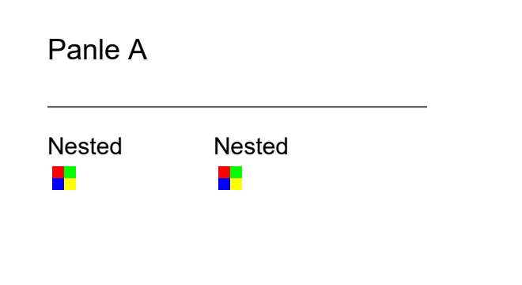
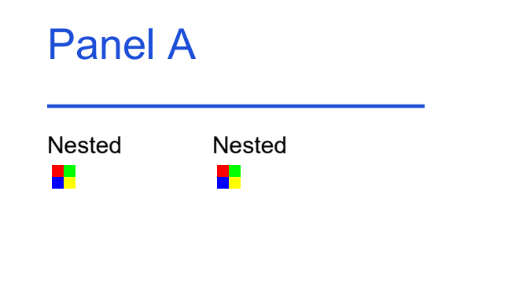

# Agent PDF Editor

**Edit the PDF figure you already have.** Correct labels, adjust typography and line styles, trim margins, and combine panels while keeping vector content.

[English](README.md) · [简体中文](README.zh-CN.md)


Agent PDF Editor is a local CLI and JavaScript API for researchers and agent developers who need targeted changes to existing PDF figures. It edits supported PDF objects directly, without an SVG round trip or regenerating the chart from data.

> **Current version: 0.2.6-alpha.1.** Windows x64 only. This is a source-build toolkit, with no desktop GUI or prebuilt installer. Editing support depends on the structure and fonts of the input PDF.

[Quick start](#quick-start) · [JavaScript example](#javascript-example) · [Capabilities](#capabilities) · [API reference](docs/API.md)

## See it work

Correct `Panle A` to `Panel A`, increase the label from 12 to 18 pt, and change the rule from 0.75 to 1.5 pt. Other objects remain unchanged.

| Before | After |
|---|---|
|  |  |

These previews come from a **generated synthetic fixture**, not a research document. Run `node scripts/demo.mjs` after building to produce the PDFs, previews, and validation receipt locally. Each run uses a new output directory.

## What you can do

- **Fix a figure label:** replace text, change font size, and adjust its color.
- **Improve readability:** change path stroke widths and colors without rebuilding the chart.
- **Prepare a multi-panel figure:** place pages or selected regions from several PDFs onto a new canvas, preserving their vector content.
- **Adjust visible margins:** crop using physical page coordinates, or compose onto a larger canvas to add space.
- **Automate repeatable edits:** inspect objects, submit a batch with explicit preconditions, and inspect the saved output and receipt.

## Quick start

You need **Windows x64**, **Node.js 24**, and an **NTFS output directory**. Building also requires an existing Visual Studio C++ x64 toolchain, Windows SDK, CMake 3.24+, and Ninja. The build script discovers Visual Studio and its bundled CMake/Ninja, with a PATH fallback for the latter two.

```powershell
git clone https://github.com/linnnn89/PDF-editor.git
cd PDF-editor
npm run setup
npm run build
node src/cli.mjs doctor
node scripts/demo.mjs
```

There are no third-party npm packages to install. `setup` downloads about 33 MB of pinned native dependencies into `vendor/`, verifies their SHA-256 checksums, and creates the ignored `test pdf/` directory. It does not install system tools or change global configuration.

The demo prints the paths to its before/after PDFs, PNG previews, and output directory. Processing is local; the editor does not call an AI service or upload PDFs. A separate agent host controls its own model calls and what tool output it sends to a model.

### Use your own PDF

Place your file at `test pdf/figure.pdf`, then inspect it and generate a preview:

```powershell
node src/cli.mjs stats "test pdf/figure.pdf" --page 0
node src/cli.mjs inspect "test pdf/figure.pdf" --limit 20
node src/cli.mjs query "test pdf/figure.pdf" --type text --text "Study" --fields textSource,editable,supportedOperations
node src/cli.mjs query "test pdf/figure.pdf" --type path --editable
node src/cli.mjs render "test pdf/figure.pdf" --output "output/preview.png" --dpi 144
```

Choose a new output name for each write. Existing files are never overwritten. CLI results are JSON on stdout; errors are JSON on stderr. When consuming JSON, call `node src/cli.mjs` directly to avoid npm's own console output.

Agents can start with `stats` for page dimensions and object counts, then use `query` to select targets. `stats` skips text, font and source-mapping extraction, counts nested panel contents, and does not determine editability. It still parses the page; use `query` or `inspect` for object details.

Use `fields` (CLI `--fields`) to return only the object properties needed for the task. IDs and types are always included; filtering, pagination and edit validation stay the same. Omitting `fields` returns full details. This reduces response size, not the first page-indexing cost, and does not require an extra query before editing.

For agent workflows, use `apply` or `compose` with `--summary --report output/receipt.json`: the model receives a compact result while the full receipt stays in a new local file. Without these options, the existing full JSON output is preserved. See [receipt handling](docs/API.md#compact-receipts--简短回执) for failure and privacy boundaries.

## JavaScript example

Save this as `edit.mjs` in the repository root. Change the input path and label to match your PDF. The target must be an editable text object; unsupported fonts or characters produce a specific error.

```javascript
import path from 'node:path';
import { openDocument } from './src/index.mjs';

const editor = await openDocument(path.resolve('test pdf/figure.pdf'));
try {
  const result = await editor.query({ page: 0, type: 'text', text: 'Study' });
  const matches = result.objects.filter(o => o.editable && o.textSource === 'Study');
  if (result.hasMore || matches.length !== 1) throw new Error('Select one exact editable label');
  const label = matches[0];

  const receipt = await editor.apply({
    sourceSha256: result.source.sha256,
    output: path.resolve('output/figure-edited.pdf'),
    operations: [{
      op: 'text.replace', page: 0, target: label.id,
      expect: { text: label.textSource }, value: 'Studies',
      fontSizePt: 15, fill: '#1D4ED8'
    }]
  });
  console.log(receipt.output);
} finally {
  await editor.close();
}
```

Pages are **zero-based**. Coordinates use physical **pt** from the top-left of the rotated visible page; 1 pt is 1/72 inch. Use object IDs and `textSource` from the current inspection, rather than guessing them.

For several edits, keep one JS session open and batch the operations. A session always edits its opened snapshot: reopen the saved output to continue editing that result. See the [API reference](docs/API.md) for cropping, composition, pagination, cancellation, and error handling.

## Capabilities

| Task | Current support |
|---|---|
| Inspect text, paths, images, fonts, and nested Forms | Read geometry, styles, and explicit editability reasons |
| Replace text or adjust size/color | Uniquely mapped, top-level horizontal text; verified character reuse and supported TrueType font extension |
| Change line width, stroke color, or fill color | Supported paths; physical stroke width requires a uniform orthogonal transform |
| Crop visible page margins | `page.crop`; changes CropBox while preserving source streams |
| Combine pages or regions | Up to 32 panels on a new page, with proportional placement and preserved vector content |
| Render previews | PNG at 36–600 dpi, up to 40 megapixels per render |
| Move line endpoints, replace images, or edit inside nested Forms | Not implemented; inspection remains available |
| Change font families, OCR a scan, or perform complex text shaping | Not implemented |

## Validation and limits

Writes use a new file and reject changed inputs or existing destinations. Object edits are reopened and checked against the requested changes, original streams, and untouched objects. A PDFium comparison at **144 dpi** requires zero changed pixels outside the allowed target regions, including a fixed antialiasing margin.

This checks editing boundaries; it does not judge whether a longer label overlaps a neighbor or whether a layout looks good. Review the preview before using a figure in a manuscript or presentation.

Saving losslessly compresses eligible new streams, including page content, font maps, and panel wrappers. Original content/resource streams and imported image, font, and nested Form resources retain their encoding. Images are not downsampled and old content is not removed. File size depends on the source structure and added fonts; an edit is not guaranteed to produce a smaller file than its input.

Composition shares identical embedded TrueType programs across panel inputs after comparing their stream dictionaries and encoded bytes. Font descriptors, character maps, and widths remain separate. The receipt reports sharing statistics; these are not a measurement of the final file-size reduction. Object edits and cropping keep their original stream-preservation behavior.

- Text keeps its original baseline origin. Automatic reflow, centering, and fitting are not provided.
- Font extension verifies glyphs, widths, and embedding permissions. Supported embedded Identity-H TrueType resources are reused after verifying the requested characters' codes, glyph IDs, and advances. Adding a full font can still increase file size; unsupported reuse cases fall back to an independent font resource.
- Composed panels contain nested Forms. To revise their internal labels, edit the inputs or pre-composition plan and compose again.
- Encrypted PDFs are not supported. Signed PDFs and files with parsing-repair warnings cannot be edited.
- Colors are DeviceRGB; ICC/CMYK prepress conversion and cross-reader rendering equivalence are not guaranteed.
- **This is not a redaction tool.** Cropping and composition can retain hidden content, and text replacement retains original streams. Never use these operations to remove confidential information.

## Development and local data

```powershell
npm test
npm run bench -- --dir "test pdf" --runs 10
npm run bench:edits -- --dir "test pdf" --runs 5
```

Tests generate their own PDFs. Font-extension tests use locally installed Arial regular and bold; font files are not bundled. Benchmarks use your own local samples and write reports under `artifacts/`. They measure local processing, not agent reasoning or model latency.

PDFs, local research directories, credentials, generated outputs, downloaded dependencies, and build products are ignored by Git. Benchmark reports and editing receipts may contain extracted text and local paths: keep them local, and review attachments before sharing an issue.

The engine uses **JavaScript / Node.js 24 + C++20**, with [PDFium](https://pdfium.googlesource.com/pdfium/) for reading and rendering, [QPDF](https://github.com/qpdf/qpdf) for writing, and [nlohmann/json](https://github.com/nlohmann/json) for JSON. Versions, download URLs, and checksums are pinned in [dependencies.lock.json](dependencies.lock.json); third-party license notices remain with the downloaded dependencies. No project license has been selected yet.

Bug reports are welcome in [GitHub Issues](https://github.com/linnnn89/PDF-editor/issues). Include the version, command, expected behavior, and error code. Prefer a synthetic reproduction over a confidential PDF.
